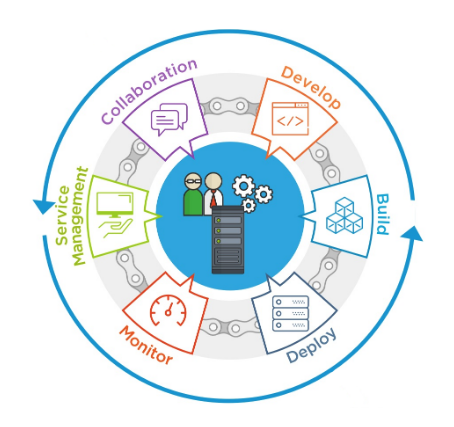

# CloudOps or Cloud Operations
The formalization of best practices and procedures that allow cloud-based platforms, and applications and data that live there, to function well over a long duration of time.

## Table of Contents
- [Needs Statement and Purpose](needs-statement-and-purpose)
  * [Scope](needs-statement-and-purpose#scope)
    + [Why CloudOps Now at OCI?](needs-statement-and-purpose#scope)

- [Heading](#heading-1)
  * [Sub-heading](#sub-heading-1)
    + [Sub-sub-heading](#sub-sub-heading-1)
- [Heading](#heading-2)
  * [Sub-heading](#sub-heading-2)
    + [Sub-sub-heading](#sub-sub-heading-2)
    
    
