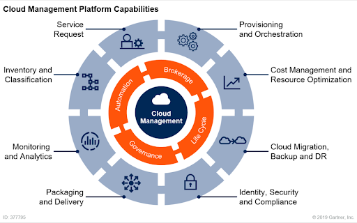

# CloudOps or Cloud Operations
The formalization of best practices and procedures that allow cloud-based platforms, and applications and data that live there, to function well over a long duration of time.

## Table of Contents
- [Needs Statement and Purpose](./needs-statement-and-purpose.md)
  * [Scope](./needs-statement-and-purpose.md#scope)
    + [Why CloudOps Now at OCI?](./needs-statement-and-purpose.md##why-cloudops-now-at-oci)
- [Cloud Architecture Planning Guide](./cloud-architecture-planning-guide.md)
